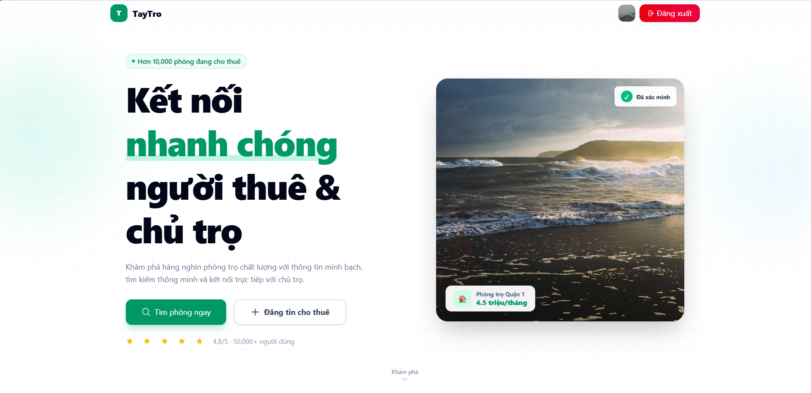
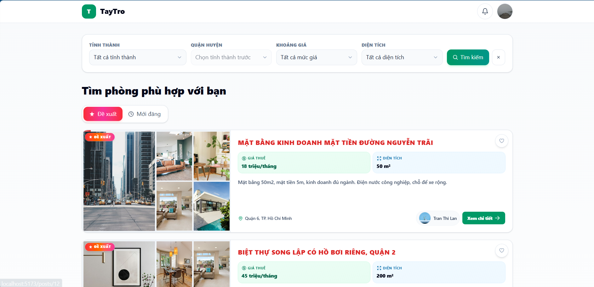
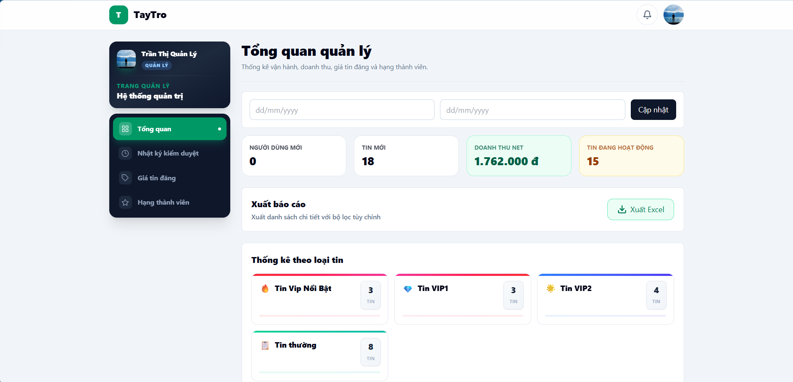
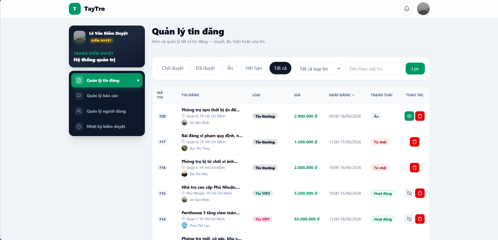
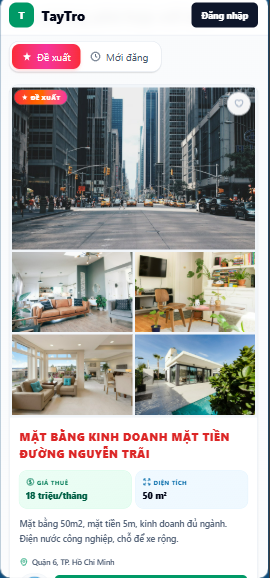
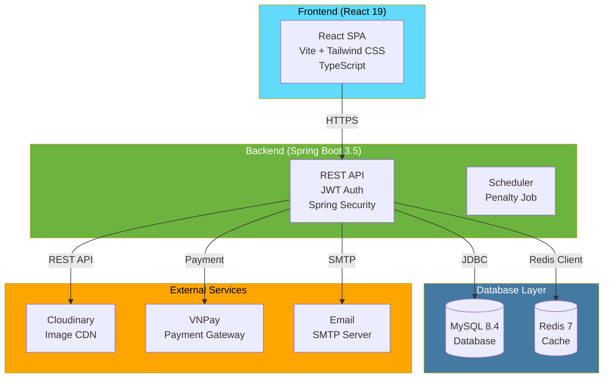
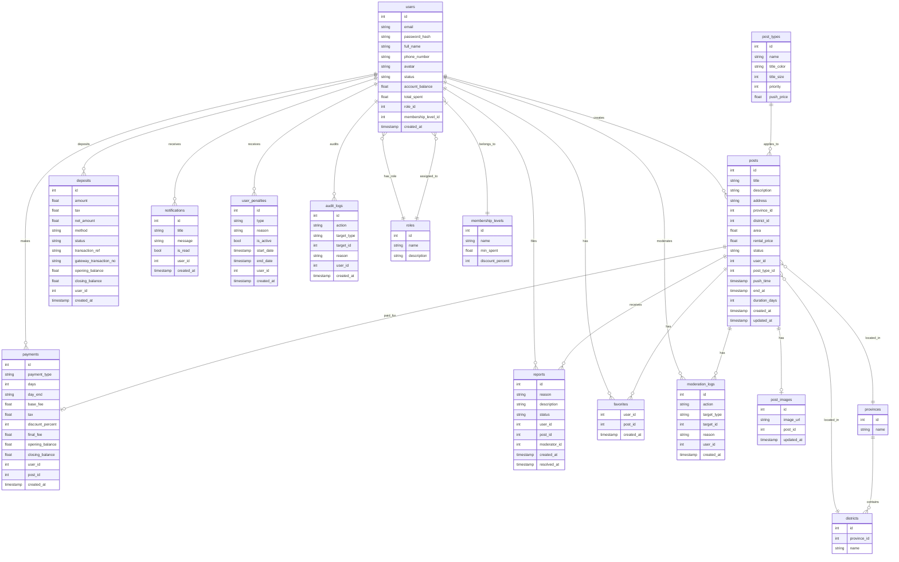
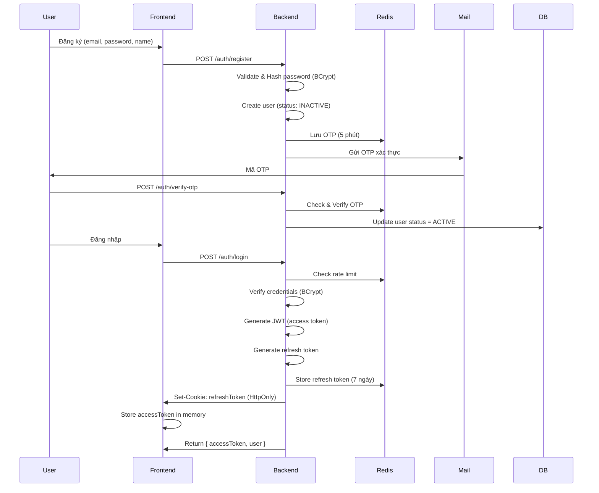
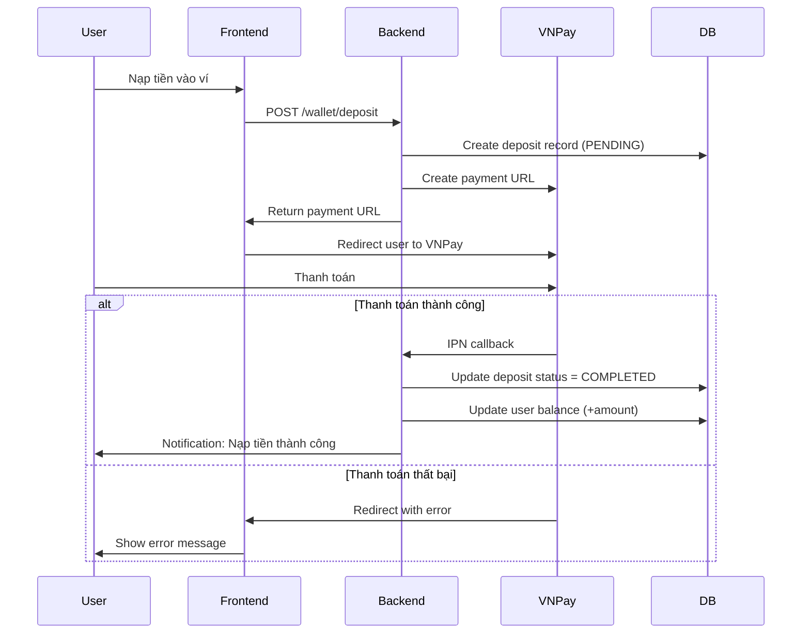
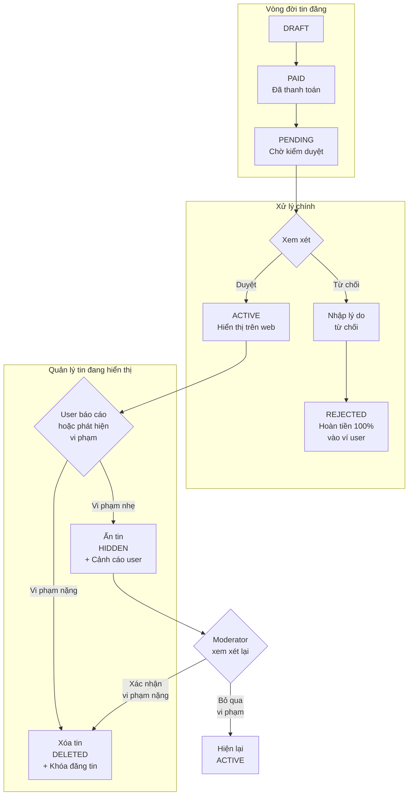

# TayTro - Nền tảng Cho thuê Phòng trọ

**Nền tảng đăng tin & quản lý cho thuê phòng trọ tại Việt Nam.**


[](LICENSE)
[](https://github.com/dylann/room-rental-app/pulls)

---

## Table of Contents

- [Giới thiệu](#1-giới-thiệu)
- [Demo](#2-demo)
- [Tính năng](#3-tính-năng)
- [Kiến trúc hệ thống](#4-kiến-trúc-hệ-thống)
- [Tech Stack](#5-tech-stack)
- [Thiết kế Database](#6-thiết-kế-database)
- [Cấu trúc thư mục](#7-cấu-trúc-thư-mục)
- [Quy trình hoạt động](#8-quy-trình-hoạt-động)
- [API](#9-api)
- [Cài đặt](#10-cài-đặt)
- [Biến môi trường](#11-biến-môi-trường)
- [Hiệu năng](#12-hiệu-năng)
- [Bảo mật](#13-bảo-mật)
- [Hướng phát triển](#14-hướng-phát-triển)
- [Known Limitations](#15-known-limitations)
- [License](#16-license)

---

## 1. Giới thiệu

### 1.1 Tổng quan

**TayTro** là nền tảng cho thuê phòng trọ được xây dựng với mục tiêu kết nối người cho thuê và người cần thuê một cách dễ dàng, nhanh chóng và an toàn. Dự án được phát triển bằng công nghệ hiện đại, đảm bảo hiệu suất cao, khả năng mở rộng và trải nghiệm người dùng tốt nhất.

### 1.2 Mục tiêu

- Cung cấp nền tảng đăng tin cho thuê phòng trọ nhanh chóng và tiện lợi
- Hỗ trợ thanh toán trực tuyến qua ví điện tử và VNPay
- Quản lý và kiểm duyệt nội dung hiệu quả
- Cung cấp hệ thống membership với nhiều cấp độ
- Đảm bảo an toàn thông tin và giao dịch

### 1.3 Đối tượng sử dụng


| Đối tượng           | Mô tả                                                             |
| ------------------- | ----------------------------------------------------------------- |
| **Người cần thuê**  | Tìm kiếm và liên hệ các tin đăng cho thuê phòng trọ               |
| **Người cho thuê**  | Đăng tin, quản lý và đẩy tin VIP để tiếp cận nhiều khách hàng hơn |
| **Kiểm duyệt viên** | Duyệt tin, xử lý báo cáo và quản lý nội dung                      |
| **Quản lý**         | Theo dõi thống kê, quản lý giá cả và membership                   |
| **Quản trị viên**   | Quản lý hệ thống, người dùng và audit logs                        |


### 1.4 Vấn đề mà dự án giải quyết

- **Thị trường rời rạc**: Khó khăn trong việc tìm kiếm thông tin phòng trọ đáng tin cậy
- **Quản lý thủ công**: Tốn thời gian trong việc quản lý tin đăng và liên hệ khách hàng
- **Thanh toán phức tạp**: Thiếu hệ thống thanh toán trực tuyến an toàn
- **Spam và tin giả**: Không có cơ chế kiểm duyệt hiệu quả

### 1.5 Điểm nổi bật

- Giao diện người dùng hiện đại, responsive
- Hệ thống ví điện tử tích hợp VNPay
- Membership đa cấp với ưu đãi giảm giá
- Dashboard thống kê trực quan cho quản lý
- Scheduled job tự động xử lý penalty và expiration
- Audit log đầy đủ cho quản trị viên

---

## 2. Demo

> [!TIP]
> Truy cập trang web để trải nghiệm đầy đủ các tính năng.

### 2.1 Screenshots

#### Trang Landing


#### Tìm kiếm


#### Chi tiết tin đăng


#### Dashboard Manager


#### Dashboard Moderator


#### Mobile View



### 2.2 Thông tin truy cập

- **Frontend**: [http://localhost:5173](http://localhost:5173)
- **Backend API**: [http://localhost:8080/api](http://localhost:8080/api)
- **Swagger UI**: [http://localhost:8080/api/swagger-ui.html](http://localhost:8080/api/swagger-ui.html)

### 2.3 Tài khoản demo


| Role      | Email                                             | Password  |
| --------- | ------------------------------------------------- | --------- |
| Admin     | [admin@phongtro.vn](mailto:admin@phongtro.vn)     | 123456aA@ |
| Manager   | [manager@phongtro.vn](mailto:manager@phongtro.vn) | 123456aA@ |
| Moderator | [mod@phongtro.vn](mailto:mod@phongtro.vn)         | 123456aA@ |
| User      | [hoa.pham@gmail.com](mailto:hoa.pham@gmail.com)   | 123456aA@ |


---

## 3. Tính năng

### 3.1 Người dùng (User)


| Tính năng         | Mô tả                                                        |
| ----------------- | ------------------------------------------------------------ |
| Đăng ký/Đăng nhập | Xác thực bằng JWT với refresh token                          |
| Đăng tin          | Tạo, chỉnh sửa và xóa tin cho thuê với upload ảnh Cloudinary |
| Tìm kiếm & Lọc    | Tìm theo quận, giá, diện tích với Redis cache                |
| Lưu tin yêu thích | Bookmark tin đăng để xem sau                                 |
| Ví điện tử        | Nạp tiền qua VNPay sandbox                                   |
| Đẩy tin VIP       | Đẩy tin lên đầu danh sách với hiệu ứng đặc biệt              |
| Gia hạn tin       | Gia hạn thời gian hiển thị của tin đăng                      |
| Thông báo         | Nhận thông báo về tin đăng và báo cáo                        |


### 3.2 Kiểm duyệt viên (Moderator)


| Tính năng          | Mô tả                                                     |
| ------------------ | --------------------------------------------------------- |
| Duyệt tin          | Phê duyệt hoặc từ chối tin đăng mới                       |
| Ẩn/Xóa tin         | Ẩn hoặc xóa tin đăng vi phạm                              |
| Quản lý báo cáo    | Xem và xử lý báo cáo từ người dùng                        |
| Xử lý vi phạm      | Cảnh cáo, khóa đăng tin, cấm tài khoản hoặc xóa hình phạt |
| Quản lý người dùng | Xem thông tin, khóa/mở khóa tài khoản người dùng          |
| Nhật ký kiểm duyệt | Xem lại các hoạt động kiểm duyệt của mình                 |


### 3.3 Quản lý (Manager)


| Tính năng           | Mô tả                                                      |
| ------------------- | ---------------------------------------------------------- |
| Dashboard thống kê  | Theo dõi tổng quan hệ thống với biểu đồ                    |
| Quản lý giá dịch vụ | Cấu hình giá VIP/Push cho từng loại tin                    |
| Quản lý membership  | 5 cấp độ thành viên với % giảm giá khác nhau               |
| Quản lý loại tin    | Cấu hình loại tin đăng (thường, VIP, nổi bật)              |
| Export Excel        | Xuất danh sách users, posts, transactions                  |
| Báo cáo             | Xem chi tiết báo cáo từ người dùng                         |
| Nhật ký kiểm duyệt  | Xem toàn bộ nhật ký kiểm duyệt của đội ngũ kiểm duyệt viên |


### 3.4 Quản trị viên (Admin)


| Tính năng                | Mô tả                                          |
| ------------------------ | ---------------------------------------------- |
| Dashboard thống kê       | Tổng quan toàn hệ thống                        |
| Quản lý tài khoản nội bộ | Tạo, cập nhật, xóa tài khoản Manager/Moderator |
| Quản lý người dùng       | Khóa/mở khóa tài khoản người dùng thường       |
| Audit logs               | Theo dõi toàn bộ hoạt động trên hệ thống       |
| Backup database          | Sao lưu và khôi phục cơ sở dữ liệu             |


---

## 4. Kiến trúc hệ thống




---

## 5. Tech Stack

### 5.1 Backend


| Technology            | Role                         | Reason                                                                                                                                                     |
| --------------------- | ---------------------------- | ---------------------------------------------------------------------------------------------------------------------------------------------------------- |
| **Java 17**           | Ngôn ngữ lập trình           | Ổn định, performance cao, LTS. Được enterprise Java ecosystem hỗ trợ tốt, tương thích ngược lâu dài. Thích hợp cho backend cần độ tin cậy cao.             |
| **Spring Boot 3.5**   | Framework                    | Ecosystem phong phú, auto-config. Giảm boilerplate đáng kể so với Spring Framework thuần. Cộng đồng lớn, tài liệu đầy đủ.                                  |
| **Spring Security**   | Authentication/Authorization | Tích hợp JWT mạnh mẽ, hỗ trợ OAuth2 sẵn sàng mở rộng. Tích hợp sẵn với Spring Data JPA.                                                                    |
| **Spring Data JPA**   | ORM                          | Đơn giản hóa database access. Giảm boilerplate CRUD, hỗ trợ transaction management tự động. Trade-off: có thể sinh inefficient queries nếu không cẩn thận. |
| **Spring Data Redis** | Cache                        | Performance optimization cho các queries thường dùng. Tích hợp sẵn với Spring ecosystem.                                                                   |
| **JWT (jjwt 0.12)**   | Token-based auth             | Stateless, scale tốt. Không cần server-side session store. Trade-off: token bị revoke khó hơn session, cần refresh token strategy.                         |
| **Lombok**            | Boilerplate reduction        | Giảm code, tăng readability. @Data, @Builder, @Slf4j giúp clean code hơn. Trade-off: compile-time magic có thể confuse IDE nếu không cấu hình đúng.        |
| **Apache POI 5.2**    | Excel export                 | Xuất báo cáo Excel. Thư viện mature, hỗ trợ đầy đủ format Excel.                                                                                           |
| **Cloudinary SDK**    | Image CDN                    | Quản lý hình ảnh hiệu quả. Tự động resize, transform, CDN distribution.                                                                                    |


### 5.2 Frontend


| Technology         | Role          | Reason                                                                                                                                                                 |
| ------------------ | ------------- | ---------------------------------------------------------------------------------------------------------------------------------------------------------------------- |
| **React 19**       | UI Library    | Component-based, declarative. Hệ sinh thái component phong phú. Hooks API mạnh mẽ cho state management.                                                                |
| **TypeScript 5**   | Ngôn ngữ      | Type safety, better DX. Bắt lỗi type errors tại compile time thay vì runtime. Trade-off: learning curve cho developer mới, nhưng đáng giá cho maintainability lâu dài. |
| **Vite 8**         | Build tool    | Fast HMR, lightning fast. Dev server khởi động nhanh hơn webpack đáng kể. Hỗ trợ ES modules native.                                                                    |
| **Tailwind CSS 4** | CSS Framework | Utility-first, responsive. Không cần viết custom CSS, consistent design system. Trade-off: HTML bớt readable, cần cấu hình purging để tránh large bundle.              |
| **React Router 7** | Routing       | Client-side navigation. SPA experience mượt, không reload page.                                                                                                        |
| **Axios**          | HTTP Client   | Interceptors, clean API. Tự động transform JSON, handle errors nhất quán.                                                                                              |


### 5.3 Infrastructure


| Technology     | Role             | Reason                                                                                                                                                                                          |
| -------------- | ---------------- | ----------------------------------------------------------------------------------------------------------------------------------------------------------------------------------------------- |
| **Docker 24**  | Containerization | Consistent environment từ dev đến prod. Dễ scale, orchestration.                                                                                                                                |
| **MySQL 8.4**  | Primary Database | Chọn MySQL thay vì MongoDB vì dữ liệu có quan hệ chặt chẽ giữa users, posts, payments — relational schema phù hợp hơn. ACID compliant, transaction support tốt. Hỗ trợ full-text search native. |
| **Redis 7**    | Cache & Session  | In-memory, fast. Dùng làm cache layer giảm DB load, store session/refresh tokens. TTL support giúp tự động cleanup.                                                                             |
| **Cloudinary** | Image Storage    | CDN, transformation. Không tốn storage server, tự động optimize images.                                                                                                                         |
| **VNPay**      | Payment Gateway  | Phổ biến tại Việt Nam, nhiều ngân hàng hỗ trợ. Sandbox environment để test.                                                                                                                     |


---

## 6. Thiết kế Database

### 6.1 ERD Diagram




### 6.2 Mô tả các bảng chính


| Bảng                | Mô tả                                           | Ghi chú thiết kế                                                                                             |
| ------------------- | ----------------------------------------------- | ------------------------------------------------------------------------------------------------------------ |
| `users`             | Người dùng hệ thống (user thường + nội bộ)      | Dùng chung bảng với `role_id` phân biệt. Có `account_balance` cho ví, `total_spent` tính membership tự động. |
| `roles`             | Vai trò người dùng                              | Phân biệt USER, ADMIN, MANAGER, MODERATOR                                                                    |
| `posts`             | Tin đăng cho thuê                               | `status` quản lý vòng đời (DRAFT→PENDING→ACTIVE→EXPIRED). `push_time` và `end_at` cho VIP/expiration.        |
| `post_images`       | Hình ảnh tin đăng                               | Tách riêng để hỗ trợ nhiều ảnh                                                                               |
| `payments`          | Thanh toán dịch vụ (đăng tin, gia hạn, đẩy tin) | Lưu chi tiết phí, thuế, discount. `final_fee` sau khi áp dụng membership discount.                           |
| `deposits`          | Nạp tiền vào ví                                 | VNPay integration: `transaction_ref`, `gateway_transaction_no` để reconcile.                                 |
| `reports`           | Báo cáo vi phạm                                 | Reporter (`user_id`) báo cáo post. Moderator xử lý (`moderator_id`).                                         |
| `moderation_logs`   | Nhật ký kiểm duyệt                              | Lưu action của moderator trên POST/REPORT/USER. Dùng `target_type` + `target_id` polymorphism.               |
| `user_penalties`    | Hình phạt user                                  | WARNING, LOCK_POST, BAN_ACCOUNT. `is_active` + `end_date` để scheduler tự disable.                           |
| `membership_levels` | Cấp độ membership                               | Threshold-based: tự động promote khi user `total_spent` đạt `min_spent`.                                     |
| `notifications`     | Thông báo user                                  | Lưu trong DB để user xem lại. `title` enum để categorize.                                                    |
| `audit_logs`        | Nhật ký admin                                   | Ghi lại mọi thao tác của admin/manager trên hệ thống.                                                        |
| `provinces`         | Tỉnh/thành phố                                  | Dữ liệu location cơ bản                                                                                      |
| `districts`         | Quận/huyện                                      | FK sang provinces                                                                                            |
| `post_types`        | Loại tin đăng (thường, VIP, nổi bật)            | Cấu hình price, color, priority                                                                              |
| `favorites`         | Tin đăng yêu thích                              | Composite PK (user_id, post_id)                                                                              |


### 6.3 Design Decisions

- **Soft delete qua status thay vì xóa record**: Posts dùng `status='DELETED'` thay vì xóa row. Giữ history cho moderation, thống kê và phòng trường hợp khôi phục nhầm. Không tốn thêm `deleted_at` column.
- **Chung bảng users cho cả user thường và nội bộ**: Phân biệt qua `role_id`. Giảm complexity khi join, không cần union queries. Trade-off: cần filter đúng role khi query để tránh leak data.
- **Membership tự động tính từ total_spent**: Thay vì admin gán thủ công, hệ thống tự calculate dựa trên tổng chi tiêu. Đảm bảo công bằng, không phụ thuộc human judgment, và cập nhật real-time khi user chi tiêu.
- **Penalty system: is_active + end_date**: Dùng hai trường thay vì chỉ end_date vì cần distinguish giữa penalty đang active và đã expired tự nhiên. Scheduler chạy định kỳ disable các penalty hết hạn, không cần delete record để giữ audit trail.
- **Audit logs không lưu old/new data**: Chỉ lưu action, target_type, target_id, reason. Không snapshot toàn bộ row. Giảm storage, nhưng trade-off là không thể rollback được. Cân nhắc thêm nếu cần compliance cao.
- **Refresh token lưu Redis thay vì DB**: Redis provide faster read/write và automatic expiration. Tránh frequent DB writes mỗi khi refresh token được use. Trade-off: Redis là single point of failure cho auth — cần persistence config nếu cần HA.

---

## 7. Cấu trúc thư mục

### 7.1 Tree Structure

```
room-rental-app/
├── backend/
│   └── api/src/main/java/com/roomrental/api/
│       ├── admin/
│       ├── auth/
│       ├── user/
│       ├── post/
│       ├── payment/
│       ├── moderation/
│       ├── manager/
│       ├── notification/
│       ├── pricing/
│       ├── location/
│       ├── integration/
│       ├── config/
│       └── common/
├── frontend/
│   └── src/
│       ├── api/
│       ├── components/
│       ├── contexts/
│       ├── constants/
│       ├── pages/
│       └── utils/
├── docker/mysql/init/
├── .env.example
├── docker-compose.yml
├── pom.xml
└── package.json
```

### 7.2 Giải thích thư mục Backend


| Thư mục         | Mô tả                                                  |
| --------------- | ------------------------------------------------------ |
| `admin/`        | Quản lý user nội bộ, audit logs, backup                |
| `auth/`         | Đăng nhập, đăng ký, JWT, refresh tokens, quên mật khẩu |
| `user/`         | Thông tin user, profile, penalties, roles              |
| `post/`         | CRUD tin đăng, favorites, hình ảnh                     |
| `payment/`      | Ví điện tử, nạp tiền VNPay, thanh toán tin, boost      |
| `moderation/`   | Duyệt tin, xử lý báo cáo, moderation logs              |
| `manager/`      | Dashboard statistics, export Excel                     |
| `notification/` | Gửi thông báo cho user                                 |
| `pricing/`      | Bảng giá loại tin, membership levels                   |
| `location/`     | Tỉnh/thành, quận/huyện                                 |
| `integration/`  | Cloudinary (upload ảnh), Email, VNPay                  |
| `config/`       | Security, JWT filter, Cloudinary config                |
| `common/`       | ApiResponse, exceptions, utilities                     |


### 7.3 Giải thích thư mục Frontend


| Thư mục       | Mô tả                                                                       |
| ------------- | --------------------------------------------------------------------------- |
| `api/`        | Axios instances và API clients cho từng module                              |
| `components/` | Reusable components (layouts, cards, modals)                                |
| `contexts/`   | AuthContext (auth state), WalletContext (balance)                           |
| `constants/`  | Route definitions                                                           |
| `pages/`      | Page components theo routing (auth, user, posts, moderator, manager, admin) |
| `utils/`      | Formatters, helpers, constants                                              |


---

## 8. Quy trình hoạt động

### 8.1 Đăng ký & Đăng nhập




### 8.2 Thanh toán & Nạp tiền




### 8.3 Quy trình kiểm duyệt

Quy trình tập trung vào **xử lý tin chờ duyệt** và **quản lý tin đang hiển thị**.



**Action chính:**

| Status | Action | Mô tả |
|--------|--------|--------|
| PENDING | **Duyệt** | Chuyển sang ACTIVE, tính ngày hết hạn |
| PENDING | **Từ chối** | Hoàn tiền 100%, gửi thông báo |
| ACTIVE | **Ẩn** | HIDDEN + cảnh cáo user |
| ACTIVE | **Xóa** | DELETED + khóa đăng tin |
| HIDDEN | **Hiện lại** | Bỏ qua, chuyển về ACTIVE |


---

## 9. API

### 9.1 Giới thiệu REST API

API được thiết kế theo chuẩn **RESTful** với các nguyên tắc:

- Sử dụng HTTP methods: GET, POST, PUT, DELETE
- Response format: JSON
- Authentication: JWT Bearer Token
- Versioning: `/api/v1/...` (future)

### 9.2 Authentication

**Header Format:**

```
Authorization: Bearer <access_token>
Content-Type: application/json
```

**Token Endpoints:**


| Method | Endpoint                    | Mô tả                       |
| ------ | --------------------------- | --------------------------- |
| POST   | `/api/auth/register`        | Đăng ký tài khoản mới       |
| POST   | `/api/auth/login`           | Đăng nhập                   |
| POST   | `/api/auth/logout`          | Đăng xuất                   |
| POST   | `/api/auth/refresh`         | Làm mới token               |
| POST   | `/api/auth/change-password` | Đổi mật khẩu                |
| GET    | `/api/auth/me`              | Lấy thông tin user hiện tại |


### 9.3 Ví dụ Request/Response

#### Đăng nhập

**Request:**

```bash
curl -X POST http://localhost:8080/api/auth/login \
  -H "Content-Type: application/json" \
  -d '{
    "email": "hoa.pham@gmail.com",
    "password": "Password123!"
  }'
```

**Response:**

```json
{
  "success": true,
  "message": "Đăng nhập thành công",
  "data": {
    "accessToken": "eyJhbGciOiJIUzI1NiIs...",
    "user": {
      "id": 1,
      "email": "hoa.pham@gmail.com",
      "fullName": "Hoa Phạm",
      "role": "USER",
      "status": "ACTIVE"
    }
  }
}
```

> [!NOTE]
> **Lưu ý về Refresh Token:**
>
> - Refresh token được tự động set vào **HTTP-Only Cookie** (không hiển thị trong response body)
> - Cookie: `refreshToken=<token>; HttpOnly; SameSite=Lax; Path=/api/auth/refresh`
> - Refresh token được lưu trong **Redis** phía server để validate
> - Client không cần và không nên handle refresh token manually

#### Tạo tin đăng

**Request:**

```bash
curl -X POST http://localhost:8080/api/posts \
  -H "Authorization: Bearer <token>" \
  -H "Content-Type: application/json" \
  -d '{
    "title": "Cần cho thuê phòng trọ quận 7",
    "description": "Phòng mới xây, có gác, WC riêng",
    "provinceId": 1,
    "districtId": 5,
    "address": "123 Đường Nguyễn Trãi",
    "area": 25.5,
    "rentalPrice": 4500000,
    "imageUrls": ["https://res.cloudinary.com/..."]
  }'
```

**Response:**

```json
{
  "success": true,
  "message": "Tin đăng đã được tạo",
  "data": {
    "id": 101,
    "title": "Cần cho thuê phòng trọ quận 7",
    "status": "PENDING",
    "createdAt": "2026-06-28T10:30:00Z"
  }
}
```

### 9.4 HTTP Status Codes


| Code  | Mô tả                 | Ví dụ sử dụng                   |
| ----- | --------------------- | ------------------------------- |
| `200` | OK                    | Thành công, trả về data         |
| `201` | Created               | Tạo mới thành công              |
| `204` | No Content            | Xóa thành công                  |
| `400` | Bad Request           | Validation error                |
| `401` | Unauthorized          | Token hết hạn hoặc không hợp lệ |
| `403` | Forbidden             | Không có quyền truy cập         |
| `404` | Not Found             | Resource không tồn tại          |
| `409` | Conflict              | Trùng lặp dữ liệu               |
| `429` | Too Many Requests     | Rate limit exceeded             |
| `500` | Internal Server Error | Lỗi server                      |


### 9.5 Error Response Format

```json
{
  "success": false,
  "message": "Email đã được sử dụng",
  "errors": [
    {
      "field": "email",
      "message": "Email đã tồn tại trong hệ thống"
    }
  ],
  "timestamp": "2026-06-28T10:30:00Z"
}
```

### 9.6 Pagination

```json
{
  "success": true,
  "data": [...],
  "pagination": {
    "currentPage": 1,
    "pageSize": 20,
    "totalItems": 150,
    "totalPages": 8,
    "hasNext": true,
    "hasPrevious": false
  }
}
```

---

## 10. Cài đặt

### 10.1 Yêu cầu hệ thống


| Requirement        | Version | Mô tả                   |
| ------------------ | ------- | ----------------------- |
| **Java**           | 17+     | OpenJDK hoặc Oracle JDK |
| **Node.js**        | 18+     | Runtime cho frontend    |
| **Docker**         | 24.0+   | Containerization        |
| **Docker Compose** | 2.0+    | Orchestration           |
| **Git**            | 2.0+    | Version control         |


> [!NOTE]
> Nếu chỉ cần chạy backend hoặc frontend riêng lẻ, hãy đảm bảo có MySQL 8.4 và Redis 7 chạy local hoặc qua Docker.

### 10.2 Hướng dẫn cài đặt

#### Bước 1: Clone dự án

```bash
git clone https://github.com/dylangk2005/room-rental-app.git
cd room-rental-app
```

#### Bước 2: Cấu hình môi trường

```bash
# Copy file cấu hình mẫu
cp .env.example .env

# Chỉnh sửa file .env và điền các giá trị cần thiết
# Xem phần Biến môi trường bên dưới
```

#### Bước 3: Khởi chạy với Docker Compose

```bash
# Build và chạy tất cả services
docker compose up --build

# Hoặc chạy background
docker compose up -d --build
```

> [!TIP]
> Lần đầu chạy sẽ mất thời gian build. Các lần sau sẽ nhanh hơn nhờ cache.

#### Bước 4: Kiểm tra


| Service     | URL                                                                                    | Status  |
| ----------- | -------------------------------------------------------------------------------------- | ------- |
| Frontend    | [http://localhost:5173](http://localhost:5173)                                         | Running |
| Backend API | [http://localhost:8080/api](http://localhost:8080/api)                                 | Running |
| Swagger UI  | [http://localhost:8080/api/swagger-ui.html](http://localhost:8080/api/swagger-ui.html) | Running |
| MySQL       | localhost:3307                                                                         | Running |
| Redis       | localhost:6379                                                                         | Running |


### 10.3 Reset Database

```bash
# Xóa toàn bộ data và restart
docker compose down -v && docker compose up --build
```

### 10.4 Chạy riêng Backend/Frontend

#### Backend (với local dependencies)

```bash
cd backend/api

# Cài đặt dependencies
./mvnw install

# Chạy ứng dụng
./mvnw spring-boot:run
```

#### Frontend (Development)

```bash
cd frontend

# Cài đặt dependencies
npm install

# Chạy development server
npm run dev
```

---

## 11. Biến môi trường

### 11.1 Danh sách biến môi trường


| Tên biến                    | Ý nghĩa                              | Ví dụ                                               | Bắt buộc |
| --------------------------- | ------------------------------------ | --------------------------------------------------- | -------- |
| **Database**                |                                      |                                                     |          |
| `MYSQL_DATABASE`            | Tên database                         | `phongtro_db`                                       | Yes      |
| `MYSQL_ROOT_PASSWORD`       | Mật khẩu root MySQL                  | `change_me_root_password`                           | Yes      |
| `MYSQL_USER`                | Username MySQL                       | `roomrental`                                        | Yes      |
| `MYSQL_PASSWORD`            | Password MySQL                       | `change_me_app_password`                            | Yes      |
| **JWT**                     |                                      |                                                     |          |
| `JWT_SECRET`                | Secret key cho JWT (min 256 bits)    | `change_me_at_least_256_bits_long...`               | Yes      |
| `JWT_EXPIRATION`            | Thời gian hết hạn access token (ms)  | `3600000`                                           | No       |
| `REFRESH_TOKEN_EXPIRATION`  | Thời gian hết hạn refresh token (ms) | `604800000`                                         | No       |
| **Redis**                   |                                      |                                                     |          |
| `REDIS_HOST`                | Host Redis                           | `redis`                                             | Yes      |
| `REDIS_PORT`                | Port Redis                           | `6379`                                              | Yes      |
| **Frontend**                |                                      |                                                     |          |
| `FRONTEND_URL`              | URL frontend                         | `http://localhost:5173`                             | Yes      |
| `VITE_API_BASE_URL`         | URL API backend                      | `http://localhost:8080/api`                         | Yes      |
| `COOKIE_SECURE`             | Cookie secure flag                   | `false`                                             | No       |
| **Email**                   |                                      |                                                     |          |
| `MAIL_HOST`                 | SMTP host                            | `smtp.gmail.com`                                    | Yes      |
| `MAIL_PORT`                 | SMTP port                            | `587`                                               | Yes      |
| `MAIL_USERNAME`             | Email gửi                            | `your_email@example.com`                            | Yes      |
| `MAIL_PASSWORD`             | App password                         | `your_app_password`                                 | Yes      |
| `MAIL_SMTP_AUTH`            | SMTP auth enable                     | `true`                                              | Yes      |
| `MAIL_SMTP_STARTTLS_ENABLE` | STARTTLS enable                      | `true`                                              | Yes      |
| **Cloudinary**              |                                      |                                                     |          |
| `CLOUDINARY_CLOUD_NAME`     | Cloud name                           | `your_cloud_name`                                   | Yes      |
| `CLOUDINARY_API_KEY`        | API key                              | `your_api_key`                                      | Yes      |
| `CLOUDINARY_API_SECRET`     | API secret                           | `your_api_secret`                                   | Yes      |
| **VNPay**                   |                                      |                                                     |          |
| `VNPAY_TMN_CODE`            | Terminal ID                          | `your_vnpay_tmn_code`                               | Yes      |
| `VNPAY_HASH_SECRET`         | Hash secret                          | `your_vnpay_hash_secret`                            | Yes      |
| `VNPAY_PAY_URL`             | Payment URL                          | `https://sandbox.vnpayment.vn/...`                  | Yes      |
| `VNPAY_RETURN_URL`          | Return URL after payment             | `http://localhost:8080/api/wallet/deposit/callback` | Yes      |
| `VNPAY_IPN_URL`             | IPN URL for async notification       | `http://localhost:8080/api/wallet/deposit/callback` | Yes      |


### 11.2 Ví dụ file .env

```env
# Database
MYSQL_DATABASE=phongtro_db
MYSQL_ROOT_PASSWORD=my_secure_root_password_2026
MYSQL_USER=roomrental
MYSQL_PASSWORD=my_secure_app_password_2026

# JWT
JWT_SECRET=your-very-long-and-secure-secret-key-at-least-256-bits-long-for-hs256

# Redis
REDIS_HOST=redis
REDIS_PORT=6379

# Frontend
FRONTEND_URL=http://localhost:5173
VITE_API_BASE_URL=http://localhost:8080/api
COOKIE_SECURE=false

# Mail
MAIL_HOST=smtp.gmail.com
MAIL_PORT=587
MAIL_USERNAME=your_email@gmail.com
MAIL_PASSWORD=xxxx xxxx xxxx xxxx
MAIL_SMTP_AUTH=true
MAIL_SMTP_STARTTLS_ENABLE=true

# Cloudinary
CLOUDINARY_CLOUD_NAME=your_cloud_name
CLOUDINARY_API_KEY=123456789012345678
CLOUDINARY_API_SECRET=xxxxxxxxxxxxxxxxxxxxxxxxxxxxxxxx

# VNPay (Sandbox)
VNPAY_TMN_CODE=YOURTMNCODE
VNPAY_HASH_SECRET=YOURHASHSECRET
VNPAY_PAY_URL=https://sandbox.vnpayment.vn/paymentv2/vpcpay.html
VNPAY_RETURN_URL=http://localhost:8080/api/wallet/deposit/callback
VNPAY_IPN_URL=http://localhost:8080/api/wallet/deposit/callback
```

---

## 12. Hiệu năng

### 12.1 Các tối ưu đã áp dụng


| Kỹ thuật            | Mô tả                                                                          |
| ------------------- | ------------------------------------------------------------------------------ |
| Redis Cache         | Cache queries thường dùng (search, filters) giảm tải database                  |
| Pagination          | Phân trang tất cả list APIs giới hạn response size                             |
| Lazy Loading        | Load ảnh khi scroll (frontend) giảm initial load time                          |
| Database Indexing   | Index trên các cột thường query (status, province_id, district_id, created_at) |
| JWT Authentication  | Stateless auth không cần session store, dễ scale horizontally                  |
| Cloudinary CDN      | Hình ảnh được cache và resize ở edge servers                                   |
| Connection Pool     | HikariCP connection pool quản lý số lượng kết nối database hiệu quả            |
| Async Processing    | Scheduled jobs chạy async không block main thread                              |
| Docker Optimization | Multi-stage build, layer caching giảm image size và build time                 |


### 12.2 Database Indexing Strategy

```sql
-- Posts table indexes for search optimization
CREATE INDEX idx_posts_status ON posts(status);
CREATE INDEX idx_posts_end_at ON posts(end_at);
CREATE INDEX idx_posts_push_time ON posts(push_time);
CREATE INDEX idx_posts_province_id ON posts(province_id);
CREATE INDEX idx_posts_district_id ON posts(district_id);
CREATE INDEX idx_posts_created_at ON posts(created_at);
CREATE INDEX idx_posts_rental_price ON posts(rental_price);
CREATE INDEX idx_posts_area ON posts(area);

-- Moderation indexes
CREATE INDEX idx_reports_status ON reports(status);
CREATE INDEX idx_reports_user_id ON reports(user_id);

-- User penalties for fast lookup
CREATE INDEX idx_user_penalties_user_id ON user_penalties(user_id);
CREATE INDEX idx_user_penalties_is_active ON user_penalties(is_active);
```

### 12.3 Redis Cache Patterns


| Key Pattern           | TTL    | Mô tả                    |
| --------------------- | ------ | ------------------------ |
| `posts:search:{hash}` | 5 min  | Search results cache     |
| `posts:province:{id}` | 5 min  | Posts by province        |
| `posts:featured`      | 1 min  | Featured/VIP posts       |
| `user:session:{id}`   | 30 min | User session cache       |
| `rate:login:{ip}`     | 15 min | Login rate limit counter |


---

## 13. Bảo mật

### 13.1 Authentication & Authorization


| Cơ chế            | Mô tả                                                  | Cấp độ |
| ----------------- | ------------------------------------------------------ | ------ |
| JWT Access Token  | Token ngắn hạn (1 giờ)                                 | High   |
| Refresh Token     | Token dài hạn (7 ngày), stored in HTTP-only cookie     | High   |
| Password Hashing  | BCrypt với cost factor 12                              | High   |
| Role-Based Access | Phân quyền theo role (ADMIN, MANAGER, MODERATOR, USER) | High   |


### 13.2 Input Validation


| Cơ chế                   | Mô tả                                            |
| ------------------------ | ------------------------------------------------ |
| Bean Validation          | @NotNull, @NotBlank, @Email, @Size, @Min, @Max   |
| Custom Validators        | Phone number, Vietnamese characters              |
| SQL Injection Prevention | JPA Parameterized queries                        |
| XSS Prevention           | Input sanitization, HTML escaping                |
| File Upload Validation   | MIME type check, size limit, extension whitelist |


### 13.3 Security Headers & Rate Limiting


| Cơ chế             | Mô tả                                    |
| ------------------ | ---------------------------------------- |
| CORS Configuration | Chỉ cho phép frontend domain             |
| Rate Limiting      | Giới hạn request/period (đặc biệt login) |
| CSRF Protection    | CSRF token cho form submissions          |
| Audit Logging      | Log tất cả actions quan trọng            |
| Secret Management  | Environment variables, không hardcode    |


---

## 14. Hướng phát triển

### 14.1 Roadmap

> [!TIP]
> Các tính năng đã hoàn thành sẽ được check

#### Phase 1: MVP (Hoàn thành)

- [x] Authentication (Register, Login, JWT)
- [x] User profile management
- [x] Post CRUD với image upload
- [x] Search & Filter
- [x] Favorites
- [x] Moderation workflow
- [x] Reports management
- [x] Wallet & VNPay integration
- [x] Membership system
- [x] Manager dashboard
- [x] Admin user management
- [x] Audit logs
- [x] Database backup

#### Phase 2: Enhanced Features (Planning)

- [ ] **Mobile App (React Native)**
  - [ ] Authentication
  - [ ] Browse & search posts
  - [ ] Create/edit posts
  - [ ] Push notifications
  - [ ] Real-time chat

- [ ] **WebSocket Notifications**
  - [ ] Real-time post status updates
  - [ ] New message notifications
  - [ ] System announcements

- [ ] **Advanced Search (Elasticsearch)**
  - [ ] Full-text search
  - [ ] Fuzzy matching
  - [ ] Autocomplete
  - [ ] Search analytics

- [ ] **AI Features**
  - [ ] Duplicate post detection
  - [ ] Image moderation (NSFW)
  - [ ] Smart pricing suggestions
  - [ ] Chatbot support

- [ ] **Advanced Analytics**
  - [ ] User behavior tracking
  - [ ] Post performance metrics
  - [ ] Revenue analytics
  - [ ] Market trends

#### Phase 3: Scale & Optimize

- [ ] **CI/CD Pipeline**
  - [ ] GitHub Actions
  - [ ] Automated testing
  - [ ] Docker Hub integration
  - [ ] Kubernetes deployment

- [ ] **Microservices Architecture**
  - [ ] Separate auth service
  - [ ] Separate notification service
  - [ ] Message queue (RabbitMQ/Kafka)

- [ ] **Multi-region Deployment**
  - [ ] CDN configuration
  - [ ] Database replication
  - [ ] Load balancing

---

## 15. Known Limitations

- **Không có real-time chat**: Người dùng liên hệ qua phone/email được hiển thị trong tin đăng. Chat giữa landlord và tenant chưa được hỗ trợ.
- **VNPay chỉ sandbox**: Thanh toán chỉ hoạt động trên VNPay sandbox environment. Tích hợp production cần merchant account thực và ký hợp đồng với VNPay.
- **Không có full-text search**: Tìm kiếm hiện tại dựa trên SQL LIKE và filter đơn giản. Không hỗ trợ fuzzy matching, autocomplete, hoặc search ranking phức tạp.
- **Không có 2FA/MFA**: Xác thực hai yếu tố chưa được implement. Chỉ có OTP qua email cho registration và forgot password flow.
- **Soft delete không có purge job**: Các records đã soft delete (deleted_at != null) không được tự động xóa vĩnh viễn sau khoảng thời gian. Database size sẽ tăng theo thời gian nếu không cleanup thủ công.
- **Không có OAuth2 social login**: Đăng nhập chỉ hỗ trợ email/password. Google, Facebook login chưa được tích hợp.

---

## 16. License

```
MIT License

Copyright (c) 2026 TayTro - Nền tảng Cho thuê Phòng trọ

Permission is hereby granted, free of charge, to any person obtaining a copy
of this software and associated documentation files (the "Software"), to deal
in the Software without restriction, including without limitation the rights
to use, copy, modify, merge, publish, distribute, sublicense, and/or sell
copies of the Software, and to permit persons to whom the Software is
furnished to do so, subject to the following conditions:

The above copyright notice and this permission notice shall be included in all
copies or substantial portions of the Software.

THE SOFTWARE IS PROVIDED "AS IS", WITHOUT WARRANTY OF ANY KIND, EXPRESS OR
IMPLIED, INCLUDING BUT NOT LIMITED TO THE WARRANTIES OF MERCHANTABILITY,
FITNESS FOR A PARTICULAR PURPOSE AND NONINFRINGEMENT. IN NO EVENT SHALL THE
AUTHORS OR COPYRIGHT HOLDERS BE LIABLE FOR ANY CLAIM, DAMAGES OR OTHER
LIABILITY, WHETHER IN AN ACTION OF CONTRACT, TORT OR OTHERWISE, ARISING FROM,
OUT OF OR IN CONNECTION WITH THE SOFTWARE OR THE USE OR OTHER DEALINGS IN THE
SOFTWARE.
```

---


**Made with by [dylangk2005](https://github.com/dylangk2005)**

**Star if you find this project useful!**

